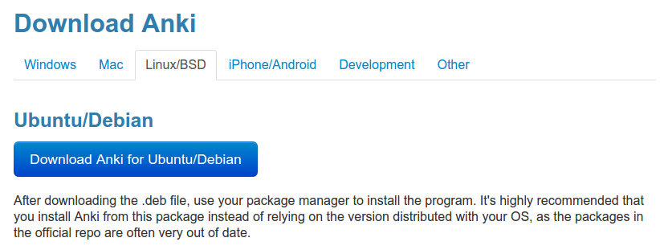
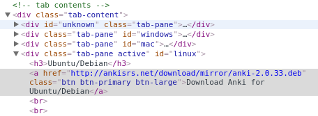

# Scrawl

Scrawl is a simple command line tool for downloading files referenced on websites using [CSS
selectors](http://www.w3schools.com/cssref/css_selectors.asp). This application is not meant to be a replacement for
[curl](http://curl.haxx.se/) or [Wget](https://www.gnu.org/software/wget/), but rather a precision tool for grabbing
files when the context in which they are presented is known to. This capability is particularly useful when the path of
the desired file is not known but the URL of the website that links to it is (common for download pages).

## Installation

If you already have the Go environment and toolchain set up, you can get the latest version by running:

```
$ go get github.com/FooSoft/scrawl
```

Otherwise, you can use the [pre-built binaries](https://github.com/FooSoft/scrawl/releases) from the project page.

## Usage

Executing Scrawl with the `-help` command line argument will trigger online help to be displayed. Below is a more
detailed description of what the parameters do.

*   `attr`: The attribute containing the desired download path is specified by this argument.
*   `dir`: This argument specifies the output directory for downloaded files.
*   `vebose`: Scrawl will output more details about what it is currently doing when this flag is set.

## Example

Let's say we want to create a script to download the latest Debian package of [Anki](http://ankisrs.net/):

1.  We load up the homepage and are presented with a big download button as shown in the screenshot below: \
    
2.  Let's copy that link so we can download the latest version with wGet or curl from our script at any time!  Hmm, it
    looks like the path `http://ankisrs.net/download/mirror/anki-2.0.33.deb` has the version number embedded in the
    filename. This means that even after a new version of Anki is released, our script will keep getting version
    `2.0.33` (unless of course it gets deleted).
3.  Let's inspect the download link in your favorite browser to see what additional information we can get: \
    
4.  It appears that we can easily create a selector for this element: `#linux > a:nth-child(2)`.  Note that
    [Chrome](https://www.google.com/chrome/) provides the option to copy the CSS selector for any element, making
    knowledge of web technology optional for this step.
5.  Now let's create a simple download and install script:
    ```bash
    #!/bin/sh
    rm -rf /tmp/anki
    mkdir /tmp/anki
    scrawl -attr=href -dir=/tmp/anki -verbose http://ankisrs.net/ "#linux > a:nth-child(2)"
    sudo dpkg -i /tmp/anki/*.deb
    sudo apt-get install -y -f
    ```
    In this script, we prepare an empty download directory and tell Scrawl to scrape `http://ankisrs.net/`, extracting
    the `href` property of the download link identified by the CSS selector `#linux > a:nth-child(2)`. We then install
    the package and bring in any unsatisfied dependencies.
